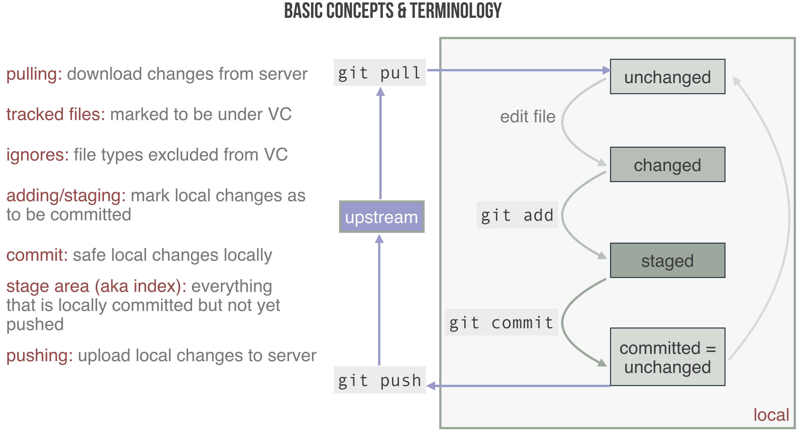

# Version control with `git`

## A plea for tidiness during collaboration

Experimental work is usually done in a team. When you work with others (and this usually includes past and future versions of yourself) it is good practice to be tidy. You want to be able to access the latest version of your work immediately. You want to be able to work in parallel, without corrupting your teammates' work. When conflicts arise, you want to solve them easily.

What you should not do, at least if you want to work with me, is send files per email, or have a shared Dropbox folder that looks like this ("aktuelle_version" means "current version"):

```{r, echo = FALSE, out.width="70%", fig.align='center'}
knitr::include_graphics("pics/folder_structure_bad_example.png")
```

A tidy folder structure instead could look like this:

```{r, echo = FALSE, out.width="100%", fig.align='center'}

```

Ideally, you document (if only for your future self) which folder contains what, e.g., using a light-weight language like [markdown](https://github.com/adam-p/markdown-here/wiki/Markdown-Cheatsheet).

## Minimal `git`

On top of a clean, and well documented folder structure, using a **version control system** is an excellent idea to boost efficient cooperation (once more: including cooperation with your future self). A currently very popular instance of VC is `git`. There are many great introductions to `git`, textbased and videos. Have your pick! There are GUIs and Apps for your smartphone. That's impressive, but I recommend using the command line, or built-in functions in your favorite text editor.

The most important thing you need to know about `git` for this course, is that `git` keeps a remote copy and as many local copies as you want of the complete history of your project, called **repository**. When you make changes locally during your work, you first tell your local repository that these changes are to stay for good: you "commit to them". When you start working you first "synchronize" your local copy of the repository with the remote, by "pulling" the latest changes to your own machine.

For this course, we will really only need the basic commands: 

- `git clone` :: to "download" a local copy of an online repository, if you do not already have one
- `git pull` :: to "update" your local copy, e.g., after others have made changes
- `git add` :: to stage changes or files for the next commit
- `git commit` :: to, well, commit yourself to the currently staged changes
- `git push` :: to to "upload" your changes, so others can pull them

The basic workflow and its main concepts are summarized here:

```{r, echo = FALSE, out.width="100%", fig.align='center'}

```


## Learning by doing

Here's an extended `git` exercise that visits the most basic, and some more advanced features of `git`. Try to carry it out step by step on your own.

### Working with a local repository

#### Creating a repository

- open a command line tool
- create a folder of your choice
  - e.g., `mkdir my_first_git`
  
#### Adding a file

- go to this directory and initialize
  - e.g., `cd my_first_git && git init`
- add a file called `mynotes.md` to the directory
- open the file with a text editor
- type some markdown & save the file
  - make sure to write several lines
- inspect the status with `git status`
- add the file to version control with `git add mynotes.md`
- inspect the status with `git status` again
- now commit your changes with `git commit -m "my first commit"`
- inspect the status with `git status` again
- look at the log history of your repo with `git log`

#### Add another file

- create another file called `mynotes_2.md`
- fill in some content of your choice
- add it to version control using the same procedure as before

#### Seeing current changes

- make some edits to `mynotes.md`
  - add text in some lines
  - delete some text in existing lines
- inspect the status with `git status`
  - this tells you which files changed, but not how exactly
- type `git diff mynotes.md` to see changes between last commit & current version
 - commit these changes
- type `git diff mynotes.md` again

#### Seeing changes between commits

- you can see what changed **in all files** from COMMIT-1 to COMMIT-2 by typing `git diff mynotes.md COMMIT-1 COMMIT-2`
  - here COMMIT-x is the commit ID (which you find in the output of `git log`)
- zoom in on changes in file `mynotes.md` with `git diff mynotes.md COMMIT-1 COMMIT-2 -- mynotes.md`
- type `git log -p mynotes.md` to get a full change history of file `mynotes.md`

#### Undoing staging

- make changes to your file `mynotes.md`
- stage the changes with `git add mynotes.md`
- look at `git status` (boring!)
- to unstage these changes type `git reset mynotes.md`
- look at `git status` again
- check whether your changes got lost (using what you learned above)

#### Undoing local changes

##### Single files

- type `git checkout mynotes.md` to undo your recent local changes
- check the status and the diff between local file and last commit

##### Whole repo

- change both of your files & inspect the status
- type `git reset --hard` to undo all local changes
- inspect status to verify

#### Going back in time

- retrieve the (shortened) commit ID of your first commit by `git log --oneline`
- type `git checkout FIRST-COMMIT-ID` to roll back complete to where you were in the beginning

#### Branching

- so far our history of developments was linear; it's time to change that
- create a new branch with `git branch silly_try`
- switch to that new branch with `git checkout silly_try`
- add one or more lines with text at the beginning (!) of `mynotes.md`
  - don't change anything else in the file!
- add & commit the changes with `git commit -a -m "changes to a branch"` 
- look at your history now with `git log --graph --oneline --all`
  - we now live in a branching-time universe
  - different developments of your project live next to each other
   
#### Merging

- we will now parallel universes together
- switch back to the master branch with `git checkout master`
- merge the changes into the master branch with `git merge silly_try`
  - if we are lucky git will merge automatically
  - if not, there will be so-called merge conflicts
  - if you have merge conflicts, you will need to resolve them manually
- commit your changes with `git commit -a -m "merged in branch silly_try"` 
- have a look at your history with `git log --graph --oneline --all`


#### Resolving merge conflicts

- when a conflict occurs and git cannot merge automatically, it creates a new file in which both changes are kept side by side
- the user must then decide by hand which changes to keep or how to merge
- use will find tools of your taste for doing this by searching the internet

### Working with a remote repository

#### Creating and linking the remote repository

- create a remote repository, e.g., on GitHub
- link your local repo to the global one with `git remote add origin YOUR-REPO-URL`
  - now `origin` is the name for your remote repo

#### Pushing and pulling

- **pushing** is when you "upload" local changes
- **pulling** is when you "download" remote changes
  - merge conflicts can arise just like when merging branches
  
  


