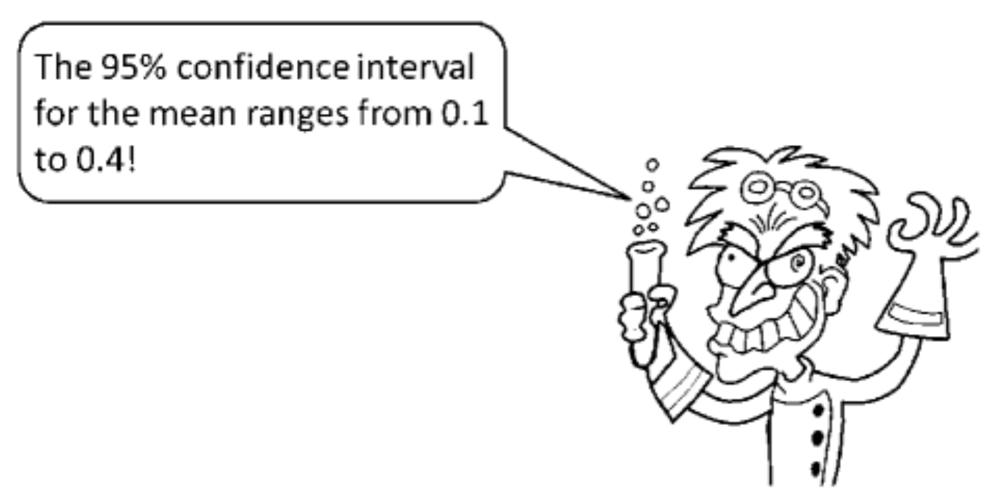

# Basics of _magpie

## Basic concepts and architecture

The basic concepts and architecture of \_magpie is covered in the [\_magpie quick start guide](https://magpie-ea.github.io/magpie-site/experiments/introduction.html).

## A first example

We will reimplement an online version of a questionaire study reported by Hoekstra et al. in a paper from 2014 that appeared in the  Psychonomic Bulletin & Review under the title "Robust misinterpretation of confidence intervals." [@HoekstraMorey2014:Robust-misinter]. The questionaire was a single paper page that looked like this:


### Getting started

- clone the "departure point" repository using

```{r, engine = 'bash', eval = FALSE}
git clone https://github.com/magpie-ea/magpie-departure-point
```

- rename the folder to a more fitting name and move to it

- download the required \_magpie packages

```{r, engine = 'bash', eval = FALSE}
npm install
```

- update the information in the file `README.md`

- download [this catchy photograph by professor Bumbledorf in action](https://magpie-ea.github.io/magpie-esslli-2019-course-material/site/script/pics/Prof-Bumbledorf.png) and place it in the `images` folder

```{r, out.width="70%", fig.align='center', echo = F}

```

- open the file `04_trials.js` and replace the previous object `trial_info` with the following:

```{r, engine = 'js', eval = FALSE}
const trial_info = {
    forced_choice: [
        {
            question: "Is the following statement a valid conclusion to draw from Prof. Bumbledorf's result, given the definition of a 'confidence interval'?",
            QUD: "Professor Bumbledorf conducts an experiment, analyzes the data, and reports:",
            picture: "images/Prof-Bumbledorf.png",
            option1: 'yes',
            option2: 'no',
            correct: 'no'
        }
    ]
};
```

- now, try out the experiment by opening the file `index.html` in the browser

### Adding more content

We now need to add the statements to be judged from the original paper, reproduced below:

- "The probability that the true mean is greater than 0 is at least 95%.",
      
- "The probability that the true mean equals 0 is smaller than 5%.",
      
- "The “null hypothesis” that the true mean equals 0 is likely to be incorrect.",
      
- "There is a 95 % probability that the true mean lies between 0.1 and 0.4.",
      
- "We can be 95 % confident that the true mean lies between 0.1 and 0.4.",
      
- "If we were to repeat the experiment over and over, then 95 % of the time the true mean falls between 0.1 and 0.4."

The problem is: where / how should we add these statements with the simple template that we are using? Ideally they should appear between the question and the repsonse buttons. Ideally, the statements should be highlighted, e.g., in bold. Can you think of a creative solution? (Hint: you can include HTML code in the strings given to fields like `question` etc.) The solution is in this footnote.^[You can write it like this: `question: "Is the following statement a valid conclusion to draw from Prof. Bumbledorf's result, given the definition of a 'confidence interval'? <br><br> <strong>The probability that the true mean is greater than 0 is at least 95%.</strong>"`]

Finally, also add an item number to each trial, i.e., consecutively number each question by inserting, for example `item: 1` for the first question, `item: 2` for the second, etc.

### Adding another view

The original paper also asked participants to rate their own statistical expertise on a scale from 1 ("no stats course taken") to 10 ("teaching statistics at a university"). Let's also add such a view *before* the questions about "confidence intervals" (because when not being able to answer the questions, participants might downgrade their self-assessed statistics expertise). We will use the [template view for rating scales](https://magpie-ea.github.io/magpie-docs/01_designing_experiments/01_template_views/#rating-scale), which gives us a rating scale from 1 to 7, but that's enough for our purposes here.

- open the file `05_views.js`

- look at the documentation of the [rating scale view](https://magpie-ea.github.io/magpie-docs/01_designing_experiments/01_template_views/#rating-scale) and copy-paste the following code (at the end of the file):

```{r, engine = 'js', eval = FALSE}
const statistical_expertise_rating = magpieViews.view_generator("rating_scale", {
    trials: 1,
    name: 'expertise_rating',
    data: [{
        question: "Please indicate your level of statistical experience from 1 (no stats course taken, no practical experience), to 7 (teaching statistics at a university)?",
        optionLeft: '',
        optionRight: ''
    }]
});
```

- open the file `06_main.js` and add the view in the right place in the view sequence, i.e., change it to:

```{r, engine = 'js', eval = FALSE}
views_seq: [
  intro,
  instructions,
  statistical_expertise_rating,
  forced_choice_2A,
  post_test,
  thanks,
]
```


### More advanced customizing

The rating scale view includes a lot of white space for a picture, but we do not have a picture right now. We can customize each view. See the [docs](https://magpie-ea.github.io/magpie-docs/01_designing_experiments/03_custom_views/) for more information on customization. Here's an example:

- change to view specification in `05_views.js` to the following: 

```{r, engine = 'js', eval = FALSE}
const statistical_expertise_rating = magpieViews.view_generator("rating_scale", {
    trials: 1,
    name: 'expertise_rating',
    data: [{
        question: "Please indicate your level of statistical experience from 1 (no stats course taken, no practical experience), to 7 (teaching statistics at a university)?",
        optionLeft: '',
        optionRight: ''
    }]
  },
  {
      stimulus_container_generator: function(config, CT) {
          return `<div class='magpie-view'>
                    <h1 class='magpie-view-title'>${config.title}</h1>
                    <p class='magpie-view-question magpie-view-qud'>${config.data[CT].QUD}</p>
                </div>`;
      }
  });
```

### Finishing the job

Though the basic functionality is there, the experiment is not polished yet. Add an appropriate welcoming message instructions, and a [begin view](https://magpie-ea.github.io/magpie-docs/01_designing_experiments/01_template_views/#begin-view) between the expertise rating and the yes/no questions. A complete example of this experiment can also be found [here](https://github.com/magpie-ea/magpie-confidence-interval-interpretation).

