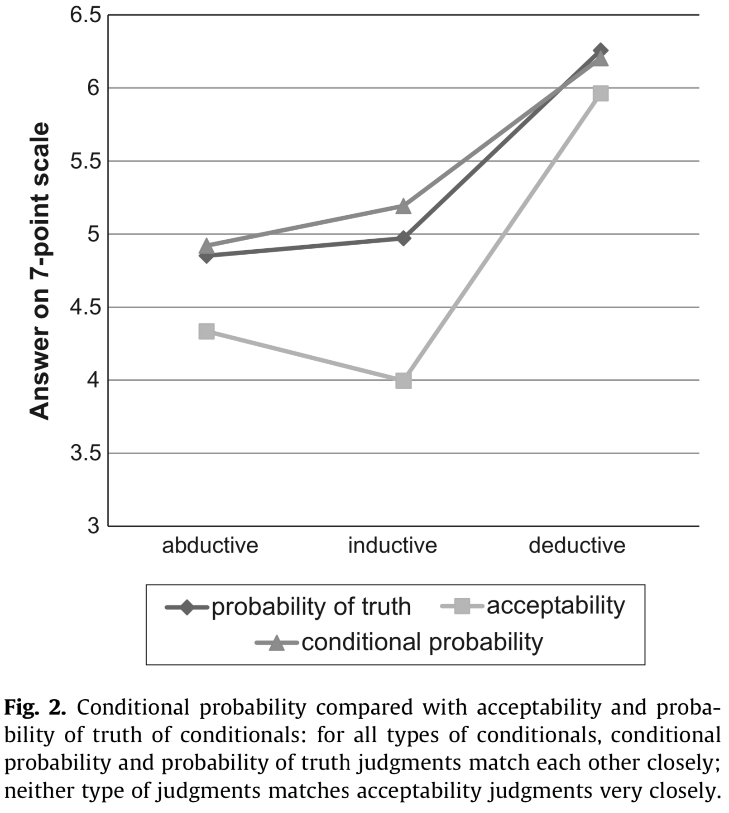

# Case study on acceptability of indicative conditionals

## Theoretical background

Adams famously proposed that the assertability of a conditional sentence $P \rightarrow Q$ is given by the conditional probability $P(Q \mid P)$ on some probability distribution representing the uncertainty of the speaker or of the interlocutors' combined [@Adams1975:The-Logic-of-Co]. @Jackson1987:Conditionals proposed a reformulation, namely that **the acceptability of a conditional $P \rightarrow Q$ is given by the conditional probability $P(Q \mid P)$**. We call this idea Adams' thesis (AT).

## "The Adams family"

### Design & Materials

@DouvenVerbrugge2010:The-Adams-famil seek to test Adams' thesis experimentally. Towards this end, they present participants with 30 vignettes, each containing a context and a conditional statement. Here is one example:

- **Context:**  All students in class 6C have at least a B for their math test paper.
- **Statement:** If Ben is in class 6C, then he has at least a B for his math test paper.

They then measured, in a between-subjects manipulation spread across three different experiments, how participants rate the statements according to four different kinds of questions, targeted at measuring different theoretical constructs:

1. **Acceptability:** Participants were asked: "*How acceptable is this statement in the given context?*" 
2. **Reasonable belief:** Participants were asked: "*How reasonable is it to believe this statement in the given context?*" 
3. **Probability of truth of conditional:** Participants were asked: "*How probable is it that this statement is true in the given context?*" 

The fourth measure, had a slightly different shape:

4. **Conditional probability:** The context included additionally the clause "Suppose that $P$ is true." and the statement to be rated was just the consequent $Q$. Participants were then asked: "*How acceptable is this statement in the given context?*" 

Of the 30 vignettes, a triplet of 10 vignettes each instantiated one of three types of conditional sentences, namely deductive, inductive and abductive conditionals.

### Hypotheses & statistical analyses

Adams' thesis is interpreted as a statement about the measures of "acceptability" and "conditional probability". Douven & Verbrugge consider a sequence of ever milder variations on AT, namely:

- **AT-strong**: $Ac(P \rightarrow Q) = P(Q \mid P)$
- **AT-approximate**: $Ac(P \rightarrow Q) \approx P(Q \mid P)$
- **AT-categorical**: $Ac(P \rightarrow Q)$ is high/middling/low iff $P(Q \mid P)$ is high/middling/low
- **AT-correlation-strong**: $Ac(P \rightarrow Q)$ highly correlates with $P(Q \mid P)$
- **AT-correlation-weak**: $Ac(P \rightarrow Q)$ at least moderately correlates with $P(Q \mid P)$

We will focus in the following on **AT-approximate** and **AT-correlation-weak** .

Moreover, Douven & Verbrugge hypothesize that, according to AT, we would not expect any differences between different types of conditionals.

In sum, we have two main hypotheses, each with a subordinate hypothesis, which the paper addresses as follows with statistical tests:

- **H1 :: AT-approximate:** There is no difference between ratings given for the "acceptability" and those given for the "conditional probability" condition. The paper tests this in the form of a main effect of GROUP in an ANOVA with factors GROUP (which question was answered) and COND-TYPE (which type of conditional sentence was rated).
  - **H1-types**: Since AT predicts no differences between types of conditionals, there should be no main effect of COND-TYPE or an interaction between GROUP and COND-TYPE. 
- **H2 :: AT-correlation-weak:** There is a positive correlation between average ratings for the "acceptability" ratings and the "conditional probability" ratings (two averaged measures for each of the 30 vignettes, compared against each other). The paper addresses this by a correlation test.
  - **H2-types**: Since AT predicts no differences between types of conditionals, there should be no difference in correlation tests when we look at each type of conditional in isolation.

### Results

@DouvenVerbrugge2010:The-Adams-famil report data that discredits Adams' thesis, at least under strong and encompassing interpretations. As for H1 and H1-types, they report a main effect of GROUP (rating "acceptability" vs rating "conditional probability"), a significant main effect of COND-TYPE and a significant interaction between the two (their Experiment 1). This result is visually discernible in the plot below, taken from @DouvenVerbrugge2010:The-Adams-famil, where data from ratings of "probability of truth of conditional" (see above) are also plotted.


```{r, echo = F, out.width = '60%', fig.align='center'}

```

@DouvenVerbrugge2010:The-Adams-famil also report a significant correlation, in general support of H2, but note that H2-types is cast into doubt because the interaction on the data with only inductive conditions is, though significant, less pronounced ($R = .65$, compared to $R = .81$ and $R = .88$ for abductive and deductive conditionals respectively).

## Replication of @DouvenVerbrugge2010:The-Adams-famil

### Preregistration procedure

Here is the example of the [preregistration report discussed in class](materials/prereg_report_Adams.pdf), together with the [pre-registered analysis file](materials/data_analysis_prereg.R) and the [pilot data](materials/data_raw_pilot.csv). The official preregistration at [osf.io](osf.io) can be found [here](http://osf.io/a36p7). The experiment can be inspected [here](https://magpie-exp-adams-family.netlify.com).

### Results

```{r setup, include=FALSE, echo = FALSE, message = FALSE}
knitr::opts_chunk$set(echo=TRUE, warning=FALSE, message=FALSE, dev.args = list(bg = 'transparent'), fig.align='center', cache=TRUE)
library(ggplot2)
theme_set(theme_bw() + theme(plot.background=element_blank()) )
```

160 participants were recruited, as planned, via online crowd-sourcing platform [Prolific](https://www.prolific.co), and were paid 1.5 British pounds for compensation, amounting to an estimated hourly wage of 7.5 pounds.

```{r}
library(tidyverse)
library(brms)
options(mc.cores = parallel::detectCores())
library(faintr)
# install this package using devtools package:
# devtools::install_github(repo = "michael-franke/bayes_mixed_regression_tutorial",subdir = "faintr")
# see https://psyarxiv.com/cdxv3 for details about the 'faintr' package

######################################
## read and prepare the data
#######################################

d = read_csv('materials/data_raw_final.csv') %>% 
  # extract information to use for analysis
  mutate(
    # what was the "rating" / "group" for each participant?
    rating = ifelse(stringr::str_detect(optionLeft, "likely"), "cond_probability", "acceptability"),
    # what was the conditional-type?
    cond_type = factor(condition, levels = c("II", "AI", "DI"), ordered = T),
    # consecutively number the items
    item_nr = factor(QUD) %>% as.integer() %>% factor()
  )
glimpse(d)
```

Following preregistered protocol, we excluded data from all participants and selected trials based on too fast reaction times.


```{r, message=T}
#######################################
## data cleaning, following 
## pre-registered exclusion protocol
#######################################

# remove all participants who responded in less than 3 
# seconds to more than 2 trials
d = d %>% group_by(submission_id) %>% 
  mutate(subj_too_fast = sum(RT<3000) > 2) %>% 
  ungroup()

message("Remove all data from ", 
        filter(d, subj_too_fast == T) %>% pull(submission_id) %>% unique() %>% length(), 
        " participants for being too fast on more than 2 trials.")

d = filter(d, subj_too_fast == F)

# remove all trials faster than 3 seconds
d = d %>% 
  mutate(trial_too_fast = RT < 3000)
  
message("Remove data from ", 
        filter(d, trial_too_fast == T) %>% nrow(), 
        " trials for being too fast.")

d = filter(d, subj_too_fast == F)
```

We can plot the average data similar for visual inspection in parallel to the above figure from the original paper:

```{r, echo = F}
#######################################
## plot average ratings
#######################################

# get aggregates
d_means = d %>% group_by(rating, cond_type) %>% 
  summarize(response = mean(response))

d_means_item = d %>% group_by(rating, cond_type, item_nr) %>% 
  summarize(response = mean(response))

d_means %>% ggplot(aes(x = cond_type, y = response, color = rating)) +
  geom_point(position = position_dodge(0.5),     alpha = 0.7,   size = 3) +
  geom_point(data = d_means_item, position = position_dodge(0.5), alpha = 0.3, size = 1) +
  ylab("mean response\n") +
  xlab("\ntype of conditional sentence") +
  theme_classic() +
  scale_x_discrete(breaks = c("II", "AI", "DI"),
                   labels = c("inductive", "abductive", "deductive")) +
  scale_colour_manual(breaks = c("acceptability", "cond_probability"),
                      labels = c("acceptability", "conditional probability"),
                      values = c("#f1a340", "#998ec3")) +
  scale_fill_manual(breaks = c("acceptability", "conditional probability"),
                      labels = c("acceptability", "conditional probability"),
                      values = c("#f1a340", "#998ec3")) +
  theme(legend.position = "right",
        legend.key.height = unit(2,"line"),
        legend.title = element_text(size = 18, face = "bold"),
        legend.text = element_text(size = 16),
        legend.background = element_rect(fill = "transparent"),
        strip.background = element_blank(),
        strip.text = element_text(size = 18, face = "bold"),
        axis.line.x = element_blank(),
        panel.spacing = unit(2, "lines"),
        plot.background = element_rect(fill = "transparent", colour = NA),
        panel.background = element_rect(fill = "transparent"),
        axis.text = element_text(size = 16),
        axis.title = element_text(size = 18, face = "bold"),
        plot.title = element_text(size = 18, face = "bold"),
        plot.margin = unit(c(0.2,0.1,0.2,0.1),"cm"))
  
```

The plot shows the means of the given ratings (we (hesitantly) follow the original paper in assuming that taking means is legitimate for this ordinal measure) for each relevant condition in the bigger dots, together with the means for each individual test sentence in the smaller dots. The latter showcases partly the variability in the given ratings.

Visually, it appears that ratings of "acceptability" are always tendetially lower, on average, that ratings of "conditional probability", irrespective of the conditional type, although this (visual!) effect seems smaller in case of deductive conditionals.

### Analyses for H1

We address H1 with a Bayesian linear hierarchical model:

```{r, results = 'hide'}
#######################################
## H1: (near-)identity reading of AT
#######################################

fit_h1 = brm(
  formula = response ~ rating * cond_type +
    (1 | submission_id + item_nr),
  data = d %>% mutate(cond_type = case_when(condition == "AI" ~ "x_AI",
                                            condition == "II" ~ "x_II",
                                            TRUE ~ "DI")),
  prior = c(prior(normal(0, 10), class = b))
)
```

To test H1, we are interested in a main effect of the RATING manipulation:

```{r}
# check for main effect of RATING factor
faintr::compare_groups(
  model = fit_h1,
  lower = list(rating = "acceptability"),
  higher = list(rating = "cond_probability")
)
```

This result tells us that our posterior belief, given model and data, that the ratings of "conditional probability" are higher should be approximately 1 (after numerical rounding).

We compare the posteriors on estimated means also for each type of conditional individually:

```{r}
# deductive
faintr::compare_groups(
  model = fit_h1,
  lower = list(rating = "acceptability", cond_type = "DI"),
  higher = list(rating = "cond_probability", cond_type = "DI")
)

# abductive
faintr::compare_groups(
  model = fit_h1,
  lower = list(rating = "acceptability", cond_type = "x_AI"),
  higher = list(rating = "cond_probability", cond_type = "x_AI")
)

# inductive
faintr::compare_groups(
  model = fit_h1,
  lower = list(rating = "acceptability", cond_type = "x_II"),
  higher = list(rating = "cond_probability", cond_type = "x_II")
)
```

These results suggest that for all types of conditional sentences, ratings of "conditional probability" were credibly larger that those of "acceptability".

### Analyses for H2

We first aggregate the data, looking at the average ratings for each sentence for each type of RATING.

```{r}
# correlation analysis
d_cor = d %>% group_by(item_nr, cond_type, rating) %>% 
  summarize(response = mean(response)) %>% 
  spread(key = "rating", value = "response") %>% 
  ungroup()

# plot the correlation
d_cor %>% ggplot(aes(x = acceptability, y = cond_probability, color = cond_type)) +
  geom_point() + geom_smooth(method = "lm")
```

To test whether there is, in general, a positive correlation between "acceptability" and "conditional probability" ratings for each sentence, we run a linear regression model based on all data first:

```{r, results = 'hide'}
# all data
fit_h2 = brm(
  formula = acceptability ~ cond_probability,
  data = d_cor,
  prior = c(prior(normal(0, 10), class = b),
            prior(normal(1, 10), coef = "cond_probability"))
)
```

```{r}
summary(fit_h2)
```


We find a 95% credible interval for the slope coefficient (called `cond_probability` in the summary table) with a lower bound of 1.09, suggesting clearly a positive overall correlation.

To test H2-types, we look at the data from each type of conditional sentence separatedly.

```{r, results = 'hide'}
# deductive conditionals
fit_h2_type_DI = brm(
  formula = acceptability ~ cond_probability,
  data = d_cor %>% filter(cond_type == "DI"),
  prior = c(prior(normal(0, 10), class = b),
            prior(normal(1, 10), coef = "cond_probability"))
)
```

```{r}
summary(fit_h2_type_DI)
```

```{r, results = 'hide'}
# abuctive conditionals
fit_h2_type_AI = brm(
  formula = acceptability ~ cond_probability,
  data = d_cor %>% filter(cond_type == "AI"),
  prior = c(prior(normal(0, 10), class = b),
            prior(normal(1, 10), coef = "cond_probability"))
)
```

```{r}
summary(fit_h2_type_AI)
```

```{r, results = 'hide'}
# inductive conditionals
fit_h2_type_II = brm(
  formula = acceptability ~ cond_probability,
  data = d_cor %>% filter(cond_type == "II"),
  prior = c(prior(normal(0, 10), class = b),
            prior(normal(1, 10), coef = "cond_probability"))
)
```

```{r}
summary(fit_h2_type_II)
```

In sum, there does seem to be evidence that for all types of conditionals, a positive correlation holds between ratings of "acceptability" and "conditional probability".

### Conclusions

The main findings of the @DouvenVerbrugge2010:The-Adams-famil were replicated: ratings of "acceptability" and "conditional probability" seem to differ, and there does seem to be a general positive correlation between the two (based on averages of ratings per item).

However, unlike @DouvenVerbrugge2010:The-Adams-famil, we do not a strong basis to conclude that different types of conditional sentences (abductive, inductive and deductive) behave (qualitatively) any differently from each other. We note that ratings for the deductive conoditionals were higher in general, and that this could also have affected the size of the difference (a ceiling effect).